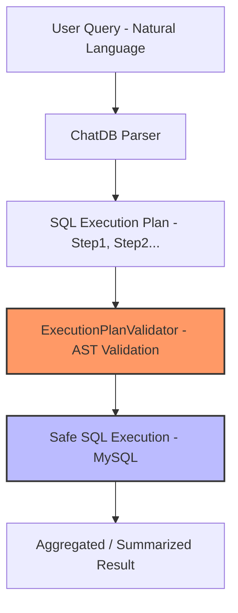

# ChatDB

**ChatDB** is an intelligent SQL query planning and execution assistant. It leverages Large Language Models (LLMs) to generate **safe, scalable, and executable SQL plans** from natural language queries. The system enforces **read-only, production-safe queries** and prevents unsafe operations such as `INSERT`, `DROP`, or use of temporary tables.

---

## Features

- **LLM-driven query planning**: Translate natural language queries into structured SQL execution steps.  
- **Step-wise decomposition**: Complex queries are split into ordered, executable steps.  
- **SQL safety enforcement**:
  - Only `SELECT` and `WITH SELECT` queries allowed
  - Blocks unsafe operations: `INSERT`, `UPDATE`, `DELETE`, `DROP`, etc.
  - Prevents temporary tables and unbounded queries
- **AST-based validation**: Ensures semantic correctness of SQL (via `sqlglot`) rather than fragile regex.  
- **Dialect-aware**: MySQL-specific validation and SQL generation.
- **Safe execution engine**: Queries are executed on the database only after validation, never exposing large datasets in memory.

---
##  Architecture

The following flowchart illustrates how a natural language query is transformed into a safe, executable SQL result:


---

### Why this is better:
* **Scalability**: If you add a new step (like "Cache Check"), you just add one line to the code.
* **Visual Clarity**: It uses actual boxes and arrows instead of keyboard symbols (`|`, `V`).
* **Safety Highlight**: In the code above, I added `style` tags to make the **Validator** and **Execution** steps stand out, emphasizing the security of your tool.

### If you prefer the text-based version:
If you don't want to use Mermaid, you should wrap your text diagram in a **code block** to ensure the characters stay aligned:

```text
User Query (Natural Language)
          │
          ▼
    ChatDB Parser
          │
          ▼
 SQL Execution Plan (Step 1, 2...)
          │
          ▼
ExecutionPlanValidator (Regex check) [AST Check will be implemented in future]
          │
          ▼
  Safe SQL Execution (MySQL)
          │
          ▼
  Aggregated / Summarized Result
```

##  Installation

Follow these steps to set up ChatDB on your local machine:

### 1. Clone the Repository
Open your terminal and run:
```bash
git clone [https://github.com/your-org/chatdb.git](https://github.com/your-org/chatdb.git)
cd chatdb
```

### 2. Create a Virtual Environment
It is recommended to use a virtual environment to manage dependencies:

```bash

# Create the environment
python -m venv chatdb

# Activate it:
# On Linux / macOS:
source chatdb/bin/activate
# On Windows:
.\chatdb\Scripts\activate
```

### 3. Install Dependencies
Once the environment is active, install the required packages:

```Bash

pip install -r requirements.txt
```

##  Configuration

ChatDB uses environment variables for database and API credentials. Create a file named `.env` in the root directory and add your details:

```env
# Database Credentials
DB_HOST=localhost
DB_USER=root
DB_PASSWORD=yourpassword
DB_NAME=sakila

# LLM Configuration
LLM_API_KEY=your_api_key
```

#   Usage
## Initialize user with database connection and LLM model
```bash
user = User(api_key="YOUR_LLM_API_KEY")

query = ChatQuery(
    query="Count the number of films in each category.",
    model="gemini-3-flash-preview",
    base_prompt="You are ChatDB, an expert SQL query planner."
)
```
## Generate SQL execution plan and execute
```bash
response = user.chat(query)
print(response)
Example Output

Copy code
Step 1: Count films in each category.
`SELECT c.name, COUNT(fc.film_id) AS film_count
 FROM category AS c
 JOIN film_category AS fc ON c.category_id = fc.category_id
 GROUP BY c.name;`
```

# Development Notes

* Parser: Extracts SQL steps from LLM output, handling backticks and triple backticks.

* Validator: Checks step numbering, read-only enforcement, forbidden keywords, and TEMP table usage.

* LLM Models: Tested with Gemini (3-pro, 3-flash) and GPT models. regex validation ensures SQL safety even if the LLM generates non-compliant SQL.

* Extensibility: Rules for column whitelisting, LIMIT enforcement, or query cost analysis can be added easily.

##  Troubleshooting & Common Errors

| Error | Cause | Solution |
| :--- | :--- | :--- |
| **Only SELECT or WITH SELECT queries are allowed** | LLM returned a non-read-only SQL statement. | Adjust prompt or validator rules; enforce read-only queries. |
| **Expected exactly one SQL statement** | LLM output contained multiple statements in a single step. | Split SQL into separate steps; validate each separately. |
| **TEMP TABLE usage is forbidden** | LLM generated `CREATE TEMPORARY TABLE`. | Rewrite query using Common Table Expressions (CTEs) or subqueries. |